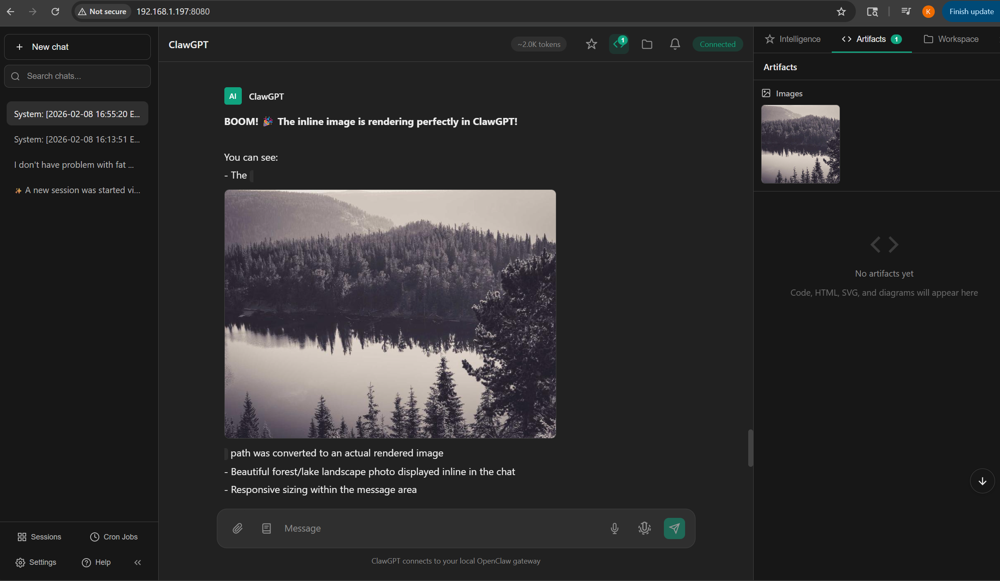

# ClawGPT

A custom chat interface for [OpenClaw](https://github.com/openclaw/openclaw) Gateway with power-user features that go beyond standard AI chat UIs.



## What is this?

ClawGPT connects directly to your OpenClaw Gateway via WebSocket, giving you a rich, responsive chat experience with features designed for power users who live in their AI assistant all day.

**Pure HTML/CSS/JS** — no build tools, no framework, no dependencies. Just open `index.html` and go.

## Features

### Core (P0)
- **💬 Real-time Chat** — WebSocket connection to OpenClaw Gateway with streaming responses
- **🔍 Conversation Search** — Search across all chat history
- **✏️ Message Editing & Branching** — Edit any message and fork the conversation
- **🎨 Code Highlighting** — Syntax highlighting for code blocks
- **📱 Cross-Device Sync** — Conversations sync via Gateway

### Power Features (P1)
- **🧠 Intelligence Panel** — Extract topics, decisions, and action items from conversations, export as Markdown
- **🎙️ Talk Mode V2** — Voice conversations with ElevenLabs streaming TTS, VAD, model switching
- **📦 Artifacts Panel** — Live preview of code, HTML, SVG, and Mermaid diagrams
- **📎 File Attachments** — Send and receive files, image preview, audio player, download cards
- **📁 Workspace Viewer** — Browse and edit OpenClaw workspace files directly
- **📊 Session Dashboard** — View and switch between all OpenClaw sessions
- **⏰ Cron Job Manager** — Create, edit, and run scheduled jobs

### Advanced Features (P2)
- **🔔 Live Notifications** — Toast system with bell icon and notification dropdown
- **📋 Prompt Library** — Save, search, and reuse prompt templates with `{{variable}}` substitution
- **🔧 Tool Call Visualization** — Expandable cards showing tool usage with color-coded status
- **⚡ Exec Approval UI** — Modal for approving/denying shell commands with 60s countdown timer
- **🖼️ Image Generation Panel** — Inline image rendering from `MEDIA:` paths, full-screen lightbox with navigation, image gallery in Artifacts panel

## Architecture

```
Browser (ClawGPT)
    ↕ WebSocket
OpenClaw Gateway
    ↕ API
AI Models (Claude, etc.)
```

- `index.html` — Page structure, modals, overlays (~1K lines)
- `app.js` — All application logic, WebSocket handling, UI components (~11K lines)
- `style.css` — Dark theme styling (~6K lines)
- `server.js` — Simple Node.js static file server with workspace API (~150 lines)

## Setup

### Prerequisites
- [OpenClaw](https://github.com/openclaw/openclaw) installed and running
- Node.js (for the server)

### Running

```bash
# Clone the repo
git clone https://github.com/hsatarian/spaceshipgpt.git
cd spaceshipgpt
git checkout jarvis

# Start the server
node server.js
# → http://localhost:8080

# Or run as a systemd service
systemctl --user start clawgpt
```

### Configuration

ClawGPT auto-connects to `ws://localhost:3777` (default OpenClaw Gateway WebSocket). Configure the Gateway URL in Settings if your setup differs.

## Screenshots

### Inline Image Rendering & Artifacts Gallery


*Images from MEDIA: paths render inline in chat. The Artifacts panel shows an image gallery with thumbnails.*

## Contributing

This is a collaborative project. The `jarvis` branch contains all power-user features. PRs welcome.

## Credits

- **SpaceshipGPT** — Original project by [Houman Satarian](https://github.com/hsatarian)
- **ClawGPT / Jarvis branch** — Power features by Kamil Gronowski & Jarvis (AI)
- **OpenClaw** — The AI assistant platform that powers everything

## License

See upstream repository for license information.
